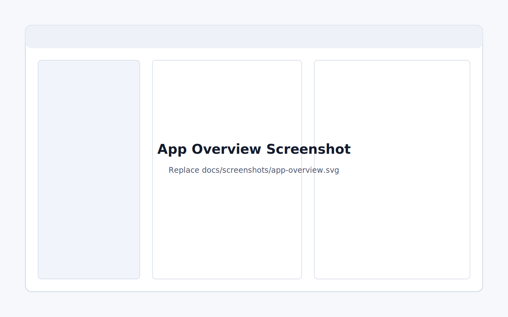
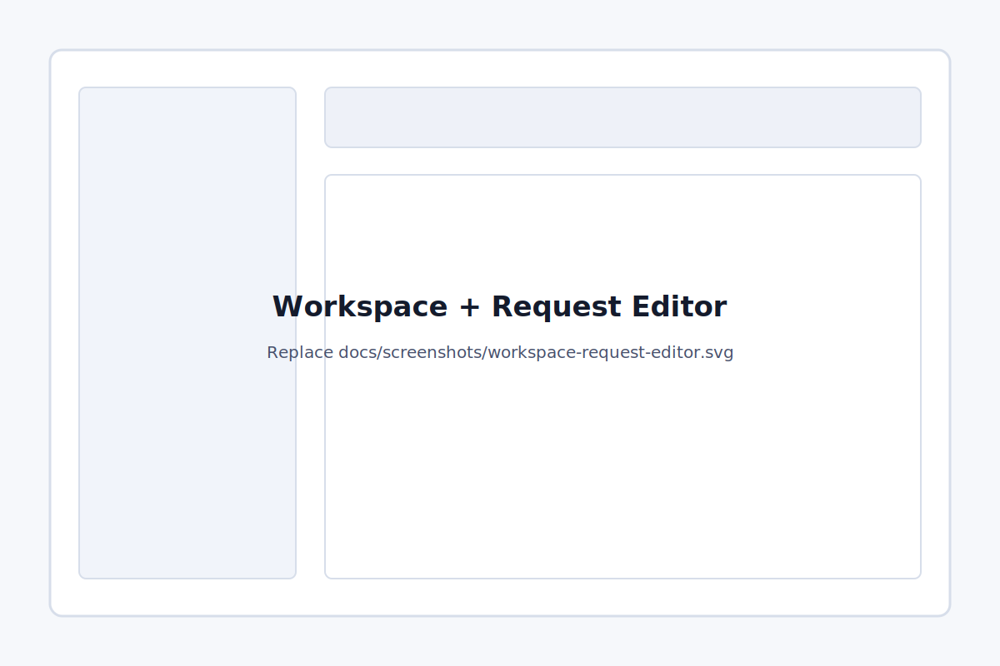
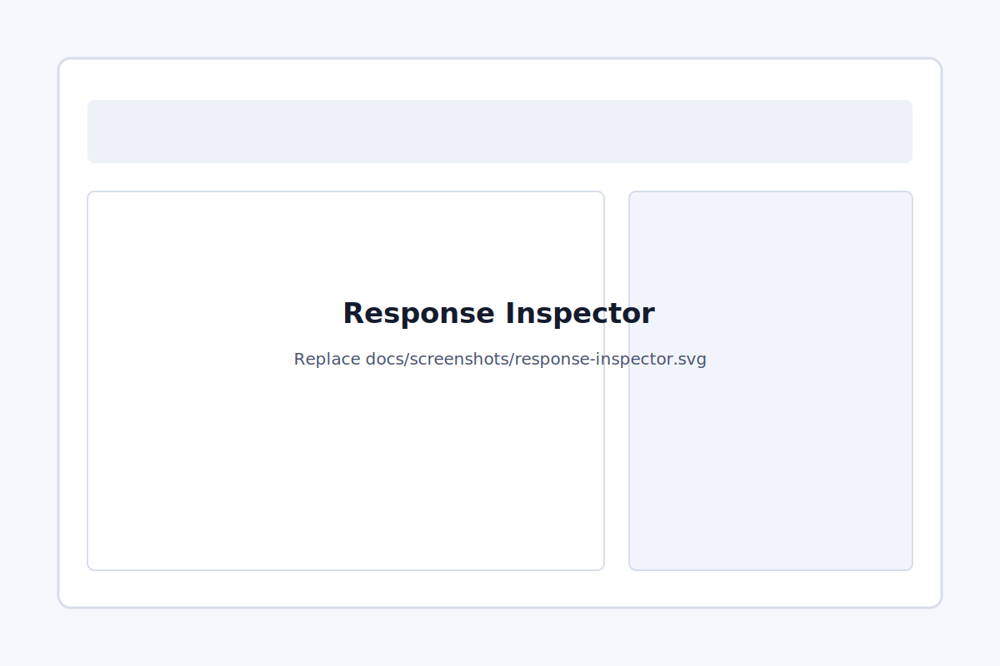
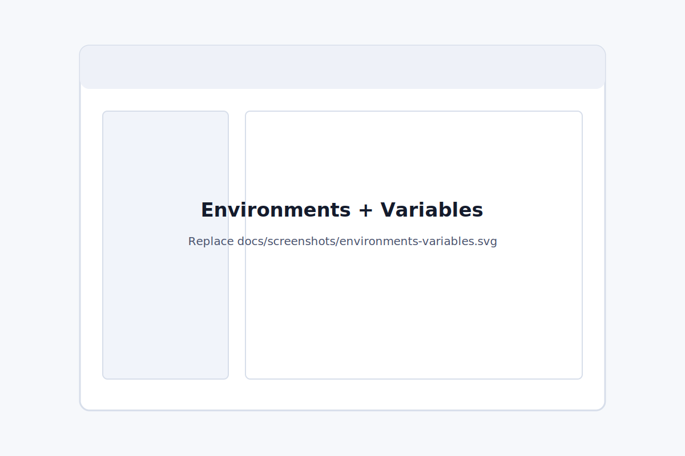
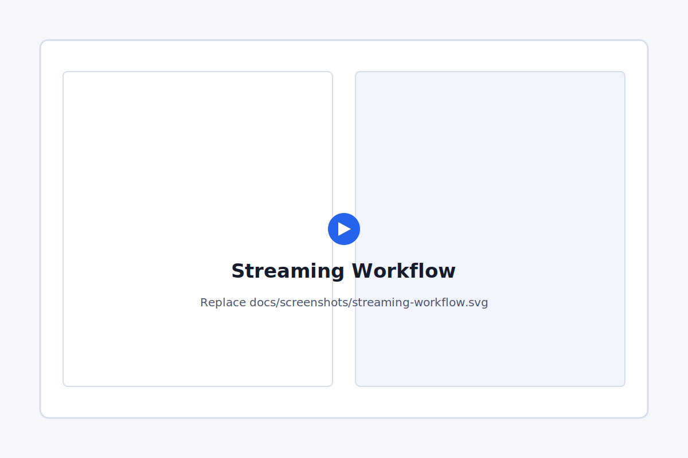

# gRPCpeek

[](LICENSE)
[](https://tauri.app/)
[](https://react.dev/)

gRPCpeek is an open-source desktop client for exploring, testing, and debugging gRPC APIs. It gives you a native, lightweight workspace for importing proto files, sending gRPC requests, inspecting responses, and organizing the requests you use every day.

It is built with Tauri, Rust, React, TypeScript, and Tailwind CSS.



## Why gRPCpeek?

Most gRPC tooling is either too heavy, too terminal-centric, or too narrow for everyday API work. gRPCpeek focuses on a clean desktop workflow:

- Import proto files or proto directories and discover services automatically.
- Send unary, server streaming, client streaming, and bidirectional streaming requests.
- Work with environments for hosts, ports, auth, TLS, metadata, and variables.
- Save reusable requests into collections and folders.
- Inspect response bodies, status, metadata, timing, size, and streaming output.
- Keep request history for repeat debugging sessions.
- Run locally as a small native app across macOS, Windows, and Linux.

## Screenshots

Replace the placeholder files in [docs/screenshots](docs/screenshots/README.md) with real captures before publishing a release announcement.

| Workspace and request editor | Response inspector |
| --- | --- |
|  |  |

| Environments and variables | Streaming workflow |
| --- | --- |
|  |  |

## Features

### Proto discovery

- Import individual `.proto` files or directories.
- Resolve multi-file proto projects with imports.
- View discovered services and methods in a searchable sidebar.
- Generate sample JSON request bodies from parsed message descriptors.

### Request workspace

- Open multiple request tabs.
- Choose service and method directly in the request editor.
- Edit JSON request bodies with formatting support.
- Add request-specific metadata.
- Use `{{env.variableName}}` and `{{global.variableName}}` placeholders in request bodies.

### Environments, auth, and TLS

- Create workspace-level environments with host and port defaults.
- Store environment variables and global variables.
- Configure default metadata per environment.
- Use bearer token, basic auth, or API key authentication.
- Configure TLS, server CA certificates, client certificates, client keys, and self-signed development flows.

### Streaming support

- Unary calls.
- Server streaming.
- Client streaming with multiple queued messages.
- Bidirectional streaming with live responses.

### Responses and history

- View formatted or raw JSON responses.
- Inspect gRPC status, response metadata, timing, response size, and message count.
- Copy or download responses.
- Open large responses externally.
- Re-run requests from local history.

### Collections

- Save requests into collections.
- Organize requests with nested folders.
- Rename and delete saved requests, folders, and collections.

## Install

Pre-built builds are intended to be published from the GitHub [Releases](https://github.com/RajaVarmaGVSSR/gRPCpeek/releases) page.

Because this is an open-source desktop app, early builds may be unsigned. Windows SmartScreen or macOS Gatekeeper may show a warning until signed releases are available.

Expected release artifacts:

- Windows: `.msi`, setup `.exe`, or portable zip.
- macOS: `.dmg` or `.app` archive.
- Linux: `.deb` or `.AppImage`.

## Build from source

### Prerequisites

- Node.js 18 or newer.
- Rust stable and Cargo.
- Tauri platform dependencies for your operating system.

Useful references:

- [Tauri prerequisites](https://tauri.app/start/prerequisites/)
- [Rust installation](https://www.rust-lang.org/tools/install)
- [Node.js downloads](https://nodejs.org/)

Linux users usually need WebKitGTK and system libraries. On Debian or Ubuntu, start with:

```sh
sudo apt-get update
sudo apt-get install -y \
  build-essential \
  curl \
  wget \
  libssl-dev \
  libgtk-3-dev \
  libayatana-appindicator3-dev \
  librsvg2-dev \
  libwebkit2gtk-4.1-dev
```

### Clone and install

```sh
git clone https://github.com/RajaVarmaGVSSR/gRPCpeek.git
cd gRPCpeek

cd grpcpeek/frontend
npm install
```

### Run in development

From the `grpcpeek` app directory:

```sh
cd grpcpeek
cargo tauri dev
```

This starts the Vite frontend on `localhost:1420` and opens the Tauri desktop shell.

### Build a production app

```sh
cd grpcpeek
cargo tauri build
```

Build output is generated under `grpcpeek/src-tauri/target/release/bundle`.

### Validation commands

```sh
cd grpcpeek/frontend
npm run build

cd ../src-tauri
cargo check
```

## Test server

This repository includes a sample gRPC server in [test-server](test-server/README.md). It is useful for local testing because it includes multiple proto files, imports, TLS modes, mTLS, self-signed certificates, and all gRPC streaming patterns.

Start it in insecure mode:

```sh
cd test-server
npm install
npm start
```

The server listens on `localhost:50051` by default.

For TLS and mTLS testing, see [test-server/certs](test-server/certs/README.md).

## Repository layout

```text
.
├── grpcpeek/
│   ├── frontend/        # React, TypeScript, Vite, Tailwind UI
│   └── src-tauri/       # Tauri 2 and Rust backend
├── test-server/         # Local gRPC server for manual testing
├── docs/
│   └── screenshots/     # Screenshot placeholders for README assets
├── LICENSE
└── README.md
```

## Contributing

Contributions are welcome. Bug reports, design feedback, docs improvements, and small focused pull requests are all useful.

Before opening a pull request:

1. Create a focused branch from the default branch.
2. Keep changes scoped to one feature, fix, or cleanup.
3. Run `npm run build` in `grpcpeek/frontend`.
4. Run `cargo check` in `grpcpeek/src-tauri`.
5. Describe what changed, why it changed, and how you tested it.

Good first contributions include:

- Improving proto parsing edge cases.
- Expanding the test server scenarios.
- Adding keyboard shortcuts.
- Improving accessibility and responsive layout.
- Polishing docs and screenshots.

## Roadmap

Ideas being explored:

- Signed release builds.
- Import and export for collections and workspaces.
- More response visualization tools.
- Request scripting or lightweight assertions.
- GitHub Actions release automation.

Open an issue if you want to help shape any of these.

## Security

Please do not open a public issue for sensitive security reports. Until a formal security policy is added, contact the maintainer privately or open a minimal issue asking for a private disclosure channel.

## License

gRPCpeek is released under the [MIT License](LICENSE).

Copyright (c) 2025 V S S R Rajavarma Ganapathiraju.
